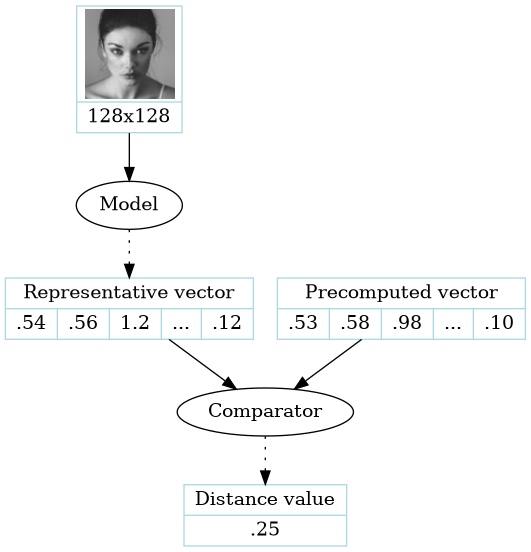
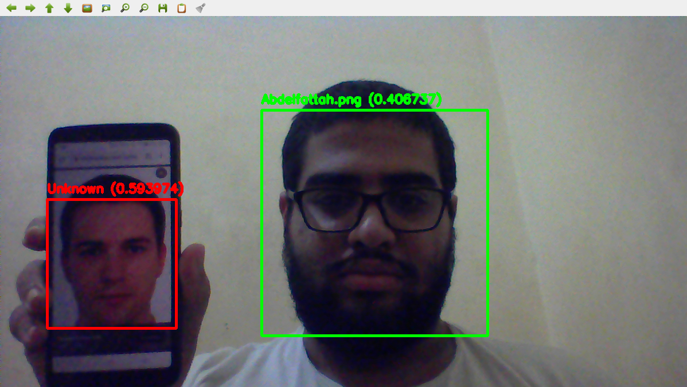

# Facial Recognition Using Deep Learning

This is a deep learning model to recognize faces and match them to a set of predefined faces using a siamese network.

## Overview

The model uses a siamese network architecture, where we don't directly compare images but rather a relatively small representative vector computed from each image. This reduces complexity of the model, as it has to be run only once for each face to be recognized, and then simple mathematical operations can be used to do the comparison. This architecture also eliminates the need for retraining the model for new faces like classifier networks.

## Usage

### Dataset

To train the model, populate the dataset directory with [this dataset](https://www.kaggle.com/abdelfattahtoulaoui/celeba-facial-recognition) or a similarly structured one.

### Training

To start the training, run:

```
python3 train.py
```

### Optimizing

When the training is done, you'll want to generate tflite file of the model:

```
python3 to_tflite.py
```

### Running

Populate the `known_faces` directory with some images of faces.

And finally to run the script to identify faces from the webcam:

```
python3 facial_recognition.py
```


## Architecture



The model uses is a standard ResNet50V2, with a few dense layers to compute the final vector value.

## Results

For our target use case, rejecting a known face is less undesirable than falsely identifying it. So we weighted the loss function to minimize false positives as much as possible.

| Overall accuracy | Sensitivity | Specificity |
|------------------|-------------|-------------|
| 79.92%           | 60.47%      | 99.37%      |

## Test

Here, you can see a screenshot of the running model.



## License

This project is licensed under the GPLv3 License - see the [LICENSE.md](LICENSE.md) file for details
